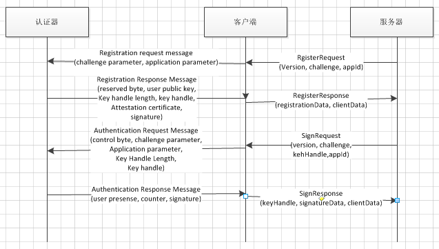
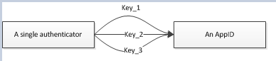

###Overview
####2.1 Motivation
fido用(Username, Authenticator, Relying Party)来限定一个registered keys.
####4. Site-Specific Public/Private Key Pairs
在认证阶段，U2F设备用Key Handle来定位user's private key. U2F设备还要确保这个Key Handle是对应那个particular origin hash的。
####7. Allowing for Inexpensive U2F Devices
Key Handle有多种实现方案：  
1. 我们普通说的，wrap私钥和hash of the origin(就是appid的hash)
2. u2f设备也可以存储这个"wrapped"信息在se之外，u2f设备之上。这种情况下，key handle就可以是一个索引值（在这种方案下，U2F设备不能确定RP发送过来的Key Handle就是该U2F设备生成的，因为Key Handle只是个整数）
3. key handle只存储origin和一个索引值，而私钥依然be kept on board——这样的话，能存储的密钥数量就取决于储存大小。

the Key Handle can 'store'(i.e., contain) the private key for the origin and the hash of the origin encrypted with a 'wrapping' key known only to the U2F device secure element.
可见在U2F中，Key Handle并不存储任何特定用户相关的东西（username什么的），这是跟UAF不一样的地方。因此会有多个User share一个U2F设备，同一个Account注册了多个U2F设备。

####8. Verifying That a U2F Device is 'genuine'
RP需要identify这个U2F设备的类型，RP可以通过查看数据库来看设备是否有RP所关心的certification characteristics。比如，银行就只接受硬件的U2F设备，而其他网站可能会接受软件实现的设备（这部分是通过RP来查看metadata service来实现的？）。  
每一个U2F设备有一个shared 'Attestation' key pair，这样就避免了一台设备一个key（这样做是因为，RP可能需要只接受特定的设备商所制造的设备，如果一台设备一个key，那么RP将维护大量的信息【certificates chaining to a root public key or literally as a list，这个方案是FIDO联盟在做，就是FIDO联盟提供的那个servcie】）

####9. Client Malware Interactions with U2F Devices
U2F设备可以直接从用户空间的client访问。

####10. U2F Device User Experience
在认证时，可能出现对一个key handle有多个U2F认证器相应的情况。比如，对于Key Handle实现方案2，Key Handle只是一个索引值，用户可能在网站上的同一个用户名注册了多个U2F设备，这些U2F设备在Key Handle索引值所指位置存储的信息都是这个网站的，那么这些U2F设备都会响应。

####11. U2F Device Usage Scenarios
#####11.1 多个User使用同一个U2F Device
由于U2F没有user的概念，因此，多个user使用同一个U2F设备，与同一个user在一个网站上有多个account概念上是一样的，U2F并不能分别。
#####11.2 同一个account注册多个U2F Device
这时，在认证时，所有注册过的Key Handle将发送给user，客户端也会返回所有u2f设备的签名给RP。

####13. Other Privacy Related Issues
#####13.1 An Origin Can Discover that Two Accounts Share a U2F Device
假设user使用同一个u2f设备在一个网站上注册了两个account，分别是u_1和u_2，那么当u_1需要认证时，RP发送KeyHandle_2给它，如果能返回正确的签名数据，那么origin就知道这两个账户使用了同一个U2F设备。

#####13.2 Revoking a Key From an Origin
U2F设备可能会有一个'reset'功能，有两个方案：  
1. Key Handles将包含有一个计数器，reset后，U2F设备将拒绝所有计数号小于U2F中所维护的计数器数的Key Handle
2. reset后，U2F设备将更换wrap算法的key，这样U2F将不能识别所有值钱生成的Key Handles。

####15. Expanding U2F to Non-browser Apps
这里U2F对AppID的处理似乎也与UAF不一样。

###Javascript API
实际上有两个API，一个是low-level MessagePort API，一个是High-level Javascript API。
####3.1 Low-level MessagePort API
RP可以通过HTML5的MessagePort interface的实例，来与FIDO client交互。Client implementations may choose how this instance is made available to web pages.（这是说，FIDO Client可以选择如何实现这个实例？什么意思？）

  

Example:  
  
**注意，其实这个代码是服务器端调用的。因为这里指定了timeoutSeconds是30秒，所以应该是服务器设置的，所以其中的回调responseHandler应该是在服务器端实现**

####3.2 High-level Javascript API
  
这个API由FIDO Client提供给服务器（因此其实现由FIDO Client实现），相当于RP在页面中调用js代码：u2f.register(...)，参数由服务器给出。由于FIDO Client实现了该API，因此由FIDO Client的实现来执行这个API。参数中的callback由服务器来实现。
**因此，我们如果用WebView的话，就需要混合编程这个u2f.register(...)的API，其实现用Android代码，接口采用js（写个简单demo模拟一下），还要注意其中的callback如何混合编程？？**

####4. U2F operations

####4.1 Registration
要给一个user account注册一个U2F token，RP要做：

* 决定RP所希望注册设备的U2F协议版本
* 选择一个合适的application id填充进registration request
* 生成一个随机数
* 保存注册相关的所有私密信息（expiration times, user ids, etc.）

  
  
FIDO Client将根据这些信息生成向U2F token传输的报文（registration request message），这个报文的一部分就是Client Data（见Raw Message）。FIDO Client收到认证器的相应后，将生成RegisterResponse返回给服务器：  
  
**其中的registrationData, clientData见Raw Message**

####4.2 Generating signed identity assertions
RP将给user account所注册过的每一个U2F token发送一个SignRequest：  
  
**注意，跟Register时里面的SignRequest一样**  

  
----
###Raw Message
####4. Registration Message
  
####4.1 Registration Request Message - U2F_REGISTER
  
其中，challenge parameter是Client Data的**SHA-256 hash** / application parameter是appID的hash  
Client Data如下：  
  
其中typ是固定值(the constant 'navigator.id.getAssertion' for authentication, and 'navigator.id.finishEnrollment' for registration)，challenge是RP给，origin就是facet_id也是RP给。
Client Data是由客户端生成的，做了stringified JSON的数据结构（UTF-8编码），做SHA-256后生成raw message中的application parameter.
>下面讲下ClientData是如何用来防止**中间人攻击**的:  
>这个ClientData是由FIDO Client根据它所看到的origin来生成的，因此在验证阶段，如果有中间人攻击，则真正的FIDO服务器所收到的ClientData中的origin将会是MITM的origin，因此服务器会拒绝。  
>如果FIDO服务器使用了ChannelID，则还要验证ClientData中的cid_pubkey。

####4.3 Registration Response Message
  
由上可见，认证器需要生成：公钥，key handle，attestation certificate，和签名  
key handle用于定位生成的key pair。包含tuple(私钥priv key, appid的hash)。  
RP验证了签名，存储公钥和key handle。

####5. Authentication Messages
####5.1 Authentication Request Message - U2F_AUTHENTICATE
  

* control byte: 
>0x07("check-only"): U2F token 应该检查 whether the provided 
 was originally created by this token, and whether it was created for the provided application parameter. **我觉得应该是这样检查，token首先unwrap这个key handle，然后取出appid，做hash后对比application parameter？？**这个主要是用于在注册过程中，客户端或许也会收到Key Handle，origin在RegisterRequest中包含Key Handle是想表示该account已经注册过的U2F设备，然后客户端收到后，需要检查这个u2f设备是否已经注册了的，此时就用'check-only'。即u2f设备只检查key handle是否是它生成，是否是为这个origin生成的。如果该u2f设备已经注册过，则返回一个authentication response message: error:test-of-user-presence-required，如果检查失败，则应返回error:bad-key-handle。
>0x03("enforce-user-presence-and-sign"): 要有真正的签名数据

**During registration, the FIDO Client may send authentication request messages to the U2F token to figure out whether the U2F token has already been registered. In this case, the FIDO client will use the check-only value for the control byte. In all other cases (i.e., during authentication, the FIDO Client must use the enforce-user-presence-and-sign value).**

----
认证的响应报文：  
  

###名词解释
#####key handle
一般包含private key和appid，wrap之后发送给server端，U2F设备使用Key Handle来identity the user's private key.因此，the Key Handle is simply an identifier of a particular key on the U2F device. The U2F device ensures that it had issued this Key Handle to that particular origin hash before performing any signing operation.

#####appid和facets
  
在UAF中：因为用户可能有多个accounts。为了分辨同一个authenticator生成的多个key pair，相当于服务器给每个key分配了一个username让用户识别。  
在U2F中：一个认证器也会有多个key pair，因为多个account注册(Alice, Bob)就会有多个key pair由这个认证器生成。  
那么，Alice登录时，怎么知道用哪个key pair？这是因为key handle对应(private key, AppID)，然后服务器那边用account关联key handle。因此服务器会发送Aliece注册的key handle给认证器（如果有多个认证器，则FIDO Client会让用户选一个？）  
认证器只需验证这个key handle是否是该认证器生成的即可。  

----

##认证器的实现
###Registration
认证器在收到FIDO Client的Registration Request Message后，参照Registration Response Message结构：  
  
由上可见，认证器需要生成：公钥(65 byte，生成算法是什么？：This is the (uncompressed) x,y-representation of a curve point on the P-256 NIST elliptic curve)，key handle(生成这个的key wrap算法是什么？：见下文)，attestation certificate(证书是什么样的？：X.509格式，DER编码)，和签名(签名算法是什么？:ECDSA signature (on P-256)，协议没规定hash算法，考虑用SHA-256(javacard v2.2.2支持))  
key handle用于定位生成的key pair。包含 tuple(私钥priv key, appid)。  
RP验证了签名，存储公钥和key handle。  

#####attestation certificate
这个是X.509格式的证书。在raw message协议中有一个证书的例子，可以参考。

#####key handle
这个Key Wrap算法如下：  
<http://csrc.nist.gov/groups/ST/toolkit/documents/kms/key-wrap.pdf>  
<https://en.wikipedia.org/wiki/Key_Wrap>  
<https://tools.ietf.org/html/rfc5297>  
<http://nvlpubs.nist.gov/nistpubs/SpecialPublications/NIST.SP.800-38F.pdf> 
关于key wrap和普通的AES算法区别如下：
<http://security.stackexchange.com/questions/40052/when-do-i-use-nist-aes-key-wrapping>
>The key wrap algorithm can be envisioned as an extended Feistel scheme which uses AES as the round function, combined with a running state which serves as a rough MAC. If you look at the algorithm definition, you will see that for each of the s rounds, one 64-bit block of data is updated, with a combination function which includes an AES invocation and another 64-bit block. The blocks are also "rotated" so that the next round updates another block, and so on. This really is akin to defining a big block cipher operating over the complete plaintext as a single "block".

>As symmetric encryption systems go, this one is quite inefficient, because it involves an average of 1.5 AES invocation per input byte (12 AES invocation for a 64-bit block), whereas GCM would use only 0.0625 AES invocation per input byte (one AES every 128-bit block). It also needs to process each input byte several times, so the entire plaintext message must be fully buffered: this will be inadequate for bulk encryption.

>The key wrap algorithm was designed to protect keys and suffers from some ritualistic overkill: a lot of accumulated AES invocations on the hope that it will make so much scrambling that the result will be strong. This is not a bad bet; if we look at it as an extended Feistel cipher, then there is some empirical data that many rounds will bring security. This should deserve some decent analysis, though, and, to my knowledge, this has not occurred yet. This is probably related to the fact that this key wrap algorithm appears not to be much used in the wild.

>**Good properties** of the AES key wrap algorithm include the following:

>It does not need randomness. Randomness is a scarce resource on many embedded systems, so having a scheme which is secure without it is nice.

>It does not need state. No EEPROM or Flash bit to modify, if only to keep a counter.

>It is deterministic. This means that wrapping the same plaintext with the same key will yield the same sequence of bytes. Determinism is mostly neutral, but occasionally useful in some protocols.

>It uses a single primitive, which is "the AES": code size is also a scarce resource on embedded systems.

>It has low size overhead: it adds only 64 bits to the input size, and includes a MAC, so that's about the smallest than can be achieved.

>**Bad properties** are mostly these ones:

>The algorithm is inefficient, with a high CPU cost per byte, and the need for full buffering. This is why the algorithm is meant for key wrapping, where "keys" are short entities, keeping the wrapping costs under reasonable limits.

>Despite its 12 years, the AES key wrapping algorithm did not benefit from a lot of analysis or even attention from the cryptographic community, probably because of its restrictive use cases.