###Overview
####7. Allowing for Inexpensive U2F Devices
the Key Handle can 'store'(i.e., contain) the private key for the origin and the hash of the origin encrypted with a 'wrapping' key known only to the U2F device secure element.
可见在U2F中，Key Handle并不存储任何特定用户相关的东西（username什么的），这是跟UAF不一样的地方。因此会有多个User share一个U2F设备，同一个Account注册了多个U2F设备。

####9. Client Malware Interactions with U2F Devices
U2F设备可以直接从用户空间的client访问。

####15. Expanding U2F to Non-browser Apps
这里U2F对AppID的处理似乎也与UAF不一样。

###Javascript API
实际上有两个API，一个是low-level MessagePort API，一个是High-level Javascript API。
####3.1 Low-level MessagePort API
RP可以通过HTML5的MessagePort interface的实例，来与FIDO client交互。Client implementations may choose how this instance is made available to web pages.（这是说，FIDO Client可以选择如何实现这个实例？什么意思？）

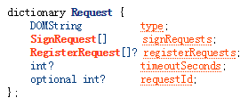  
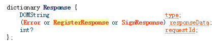

Example:  
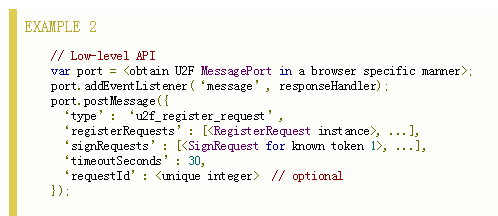  
**注意，其实这个代码是服务器端调用的。因为这里指定了timeoutSeconds是30秒，所以应该是服务器设置的，所以其中的回调responseHandler应该是在服务器端实现**

####3.2 High-level Javascript API
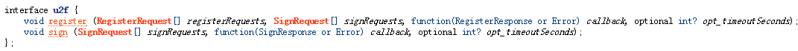  
这个API由FIDO Client提供给服务器（因此其实现由FIDO Client实现），相当于RP在页面中调用js代码：u2f.register(...)，参数由服务器给出。由于FIDO Client实现了该API，因此由FIDO Client的实现来执行这个API。参数中的callback由服务器来实现。
**因此，我们如果用WebView的话，就需要混合编程这个u2f.register(...)的API，其实现用Android代码，接口采用js（写个简单demo模拟一下），还要注意其中的callback如何混合编程？？**

####4. U2F operations
####4.1 Registration
要给一个user account注册一个U2F token，RP要做：

* 决定RP所希望注册设备的U2F协议版本
* 选择一个合适的application id填充进registration request
* 生成一个随机数
* 保存注册相关的所有私密信息（expiration times, user ids, etc.）

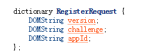  
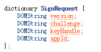  
FIDO Client将根据这些信息生成向U2F token传输的报文（registration request message），这个报文的一部分就是Client Data（见Raw Message）。FIDO Client收到认证器的相应后，将生成RegisterResponse返回给服务器：  
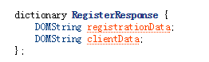  
**其中的registrationData, clientData见Raw Message**

####4.2 Generating signed identity assertions
RP将给user account所注册过的每一个U2F token发送一个SignRequest：  
  
**注意，跟Register时里面的SignRequest一样**  
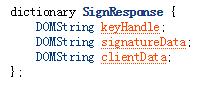  

###Raw Message
####4. Registration Message
####4.1 Registration Request Message - U2F_REGISTER
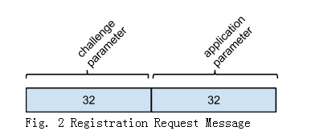  
其中，challenge parameter是Client Data的SHA-256 hash / application parameter是appID的hash  
Client Data如下：  
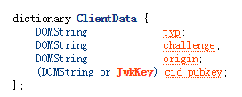  
其中typ是固定值，challenge是RP给，origin就是facet_id也是RP给。

####4.3 Registration Response Message
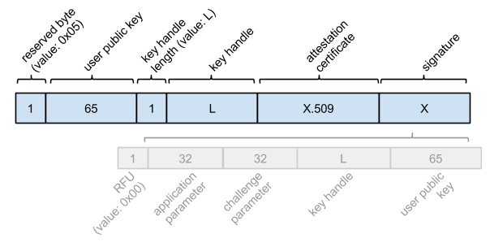  
由上可见，认证器需要生成：公钥，key handle，attestation certificate，和签名  
key handle用于定位生成的key pair。包含 私钥priv key, appid。  
RP验证了签名，存储公钥和key handle。

####5. Authentication Messages
####5.1 Authentication Request Message - U2F_AUTHENTICATE
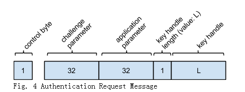  

* control byte: 
>0x07("check-only"): U2F token 应该检查 whether the provided key handle was originally created by this token, and whether it was created for the provided application parameter. **我觉得应该是这样检查，token首先unwrap这个key handle，然后取出appid，做hash后对比application parameter？？**
>0x03("enforce-user-presence-and-sign"): 要有真正的签名数据

**During registration, the FIDO Client may send authentication request messages to the U2F token to figure out whether the U2F token has already been registered. In this case, the FIDO client will use the check-only value for the control byte. In all other cases (i.e., during authentication, the FIDO Client must use the enforce-user-presence-and-sign value).**

----
认证的响应报文：  
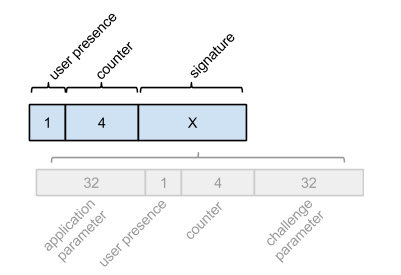  

