#关于FIDO的注册过程总结
###一、FIDO Server 向 FIDO Client 发送的UAF Registration Request
UAF Registration Request 的结构如下：

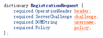  

官方的协议文档给了一个例子如下所示：
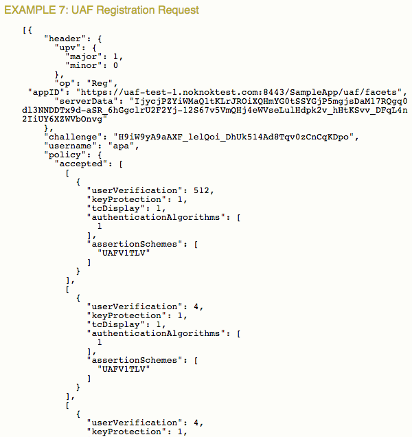  
>这个图没有截取完全，不过不影响理解。
注意到，**username是由FIDO Server生成的，此username并不是我们一般意义上的一般网站的用户名，而是FIDO对于一次认证器注册所生成的username（因为一个用户名可以注册多个认证器）。所以，在注册认证器之前，用户还是需要一般意义上的用户名密码去登陆网站，然后向FIDO服务器选择注册一个认证器。根据AppID-facetID文档，用户还可以给这个username取一个nickname，比如“我的指纹认证器”，“YZ的声音认证器等等”**

上面报文中header的结构固定，详细情况见【名词解释】

Policy中的元素见【名词解释】

###二、FIDO Client解析注册请求并生成ASM Request
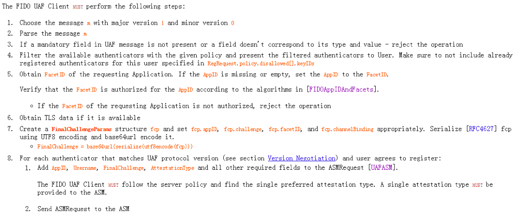  

下面仅对一些必要步骤做出说明：

* 1.选择版本号为1.0的报文m
* 4.根据请求报文中的策略过滤可用的认证器，特别是根据KeyIDs过滤已经注册过的认证器
* 5.关于获取FacetID的算法和设置AppID的方法，详见【名词解释】中的AppID。
* 6.如果可用的话，获取TLS data。这里TLS data就是FinalChall中的channelBinding（祥见【名词解释】）。ebay源码实现中将其设置为””
* 7.生成FinalChallengeParams（fcp结构），并设置fcp.appID, fcp.challenge, fcp.facetID和fcp.channelBinding。
	* 计算方法：FinalChallenge = base64url(serialize(utf8encode(fcp)))
* 8.生成ASM Request报文：
	* 首先生成RegisterIn Object：
	
	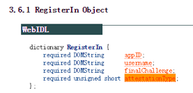
	* 然后再生成ASM Request：
	
	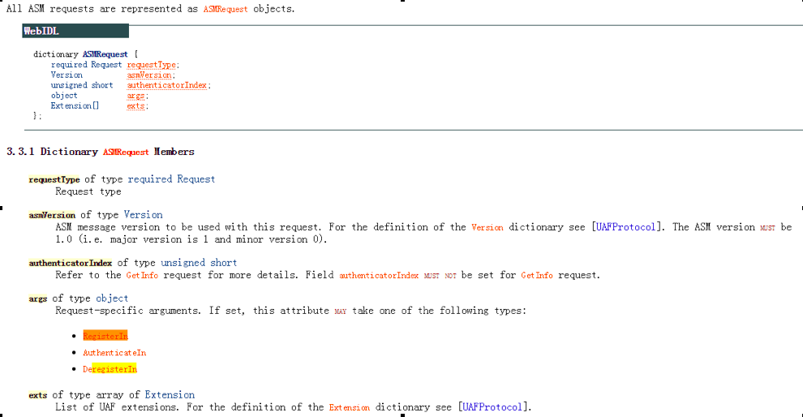
		* requestType包括：GetInfo, Register, Authenticate, Deregister, GetRegistrations, OpenSettings
		* authenticatorIndex由GetInfo方法获得。
		* 在注册过程中，args就是RegisterIn Object

更详尽的ASM Register Request处理过程如下:  
    

* 1.通过`authenticatorIndex`定位认证器（之前会让用户选择一个认证器来注册，由此获得`authenticatorIndex`）  
* 4.生成KHAccessToken【见名词解释】
* 5.通过认证器指定算法对`RegisterIn.finalChallenge`做hash，得FinalChallengeHash(**所指定算法是通过GetInfo得到`AuthenticatorInfo.authenticationAlgorithm`**)
* 6.构造`TAG_UAFV1_REGISTER_CMD`传给认证器
* 8.解析`TAG_UAFV1_REGISTER_RESP`，取出`TAG_KEYID`
* 9.如果是bound authenticator，那就存储`CallerID`,`AppID`,`TAG_KEYHANDLE`,`TAG_KEYID`和`CurrentTimestamp`（这个还是根据认证器的实现来的，如果认证器自己有内部安全存储，那么也可以存放在认证器内部）

###三、ASM向Authenticator发送Register Command
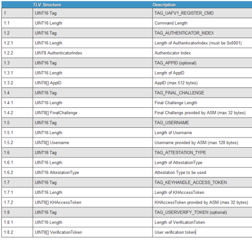  

KHAccessToken: 【名词解释】

VerificationToken: 【名词解释】

其余都可以从 ASM Request中获取

###四、Authenticator收到Register Command之后做以下操作
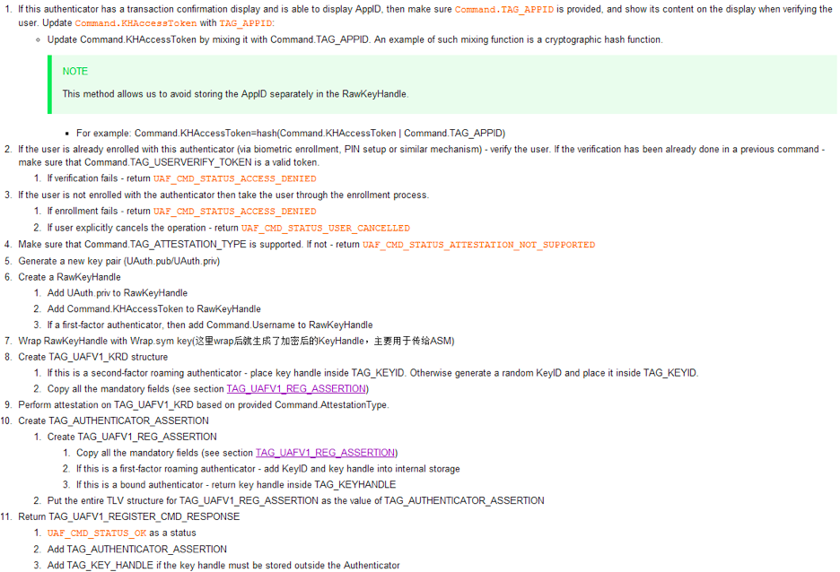  

第5步，生成公私钥对，其算法应该是由认证器自己metadata中的publicKeyAlgAndEncoding来指明的。

第6步，生成RawKeyHandle，见【名词解释】

第7步，Wrap RawKeyHandle，关于Key Wrap的算法，见【名词解释】

第8步，生成KRD结构：
如果是second-factor roaming authenticator，则将key handle放入TAG_KEYID；
否则随机生成KeyID放入TAG_KEYID（__这是我们关心的策略__）；

---
KRD是包含在整个authenticator返回的assertion中的，assertion的结构如下（KRD结构应该在签名数据前都是）
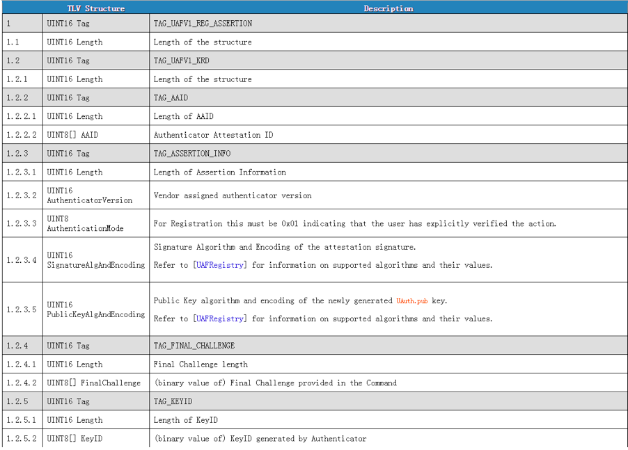  
  
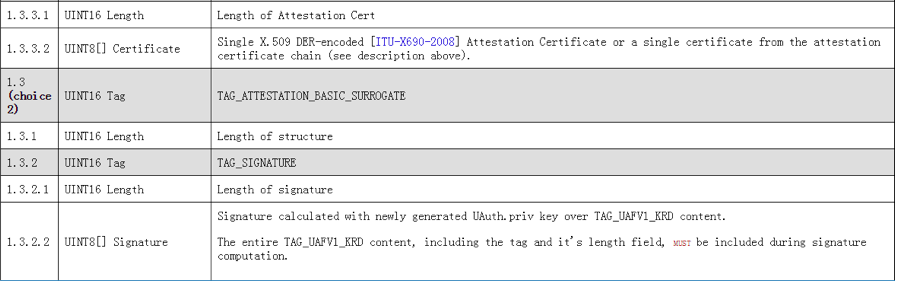  
因此，这个KRD包含：AAID，ASSERTION_INFO(AuthenticatorVersion, AuthenticationMode, SignatureAlgAndEncoding, PublicKeyAlgAndEncoding)，FINAL_CHALLENGE，KEYID，COUNTERS, PUB_KEY

注意,上面的TAG_ATTESTATION_CERT可能会出现多次，它是一个证书链，后出现的证书是前一个证书的颁发者。第一个一定是attestation certification，最后一个一定是attestationRootCertificates（这是一个trust anchor证书数组，见【名词解释】）中的一个。

---
第9步，根据AttestationType去生成下面的签名，证书链之类。

第10步，生成TAG_AUTHENTICATOR_ASSERTION:

1. 如果是一个first-factor roaming authenticator - add KeyID and key handle into internal storage.
2. 如果是一个bound authenticator - return key handle inside TAG_KEYHANDLE(在TAG_UAFV1_REGISTER_CMD_RESPONSE - 这是个authenticator最终返回给ASM的报文)

第11步，生成authenticator最终返回給ASM的报文TAG_UAFV1_REGISTER_CMD_RESPONSE：

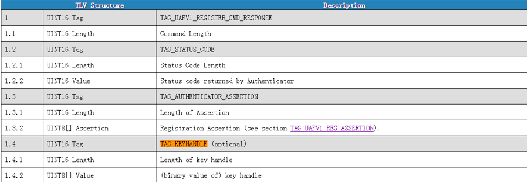  
注意最后关于KeyID有这么一句：
>If the KeyID is generated randomly(instead of, for example, being derived from a key handle) - it should be stored inside RawKeyHandle so that it can be accessed by the authenticator while processing the Sign command.

__这里是这么解释__，RawKeyHandle的结构一般只包括：KHAccessToken, UAuth.priv, Username Size, Username，但是实际上，RawKeyHandle的结构是跟authenticator的具体实现有关，因此是可以放入KeyID的。（__这里随机生成KeyID并放入KeyID也是我们所关心的策略，将在之后的验证过程中用到KeyID__）

###五、生成UAF Client的Response报文

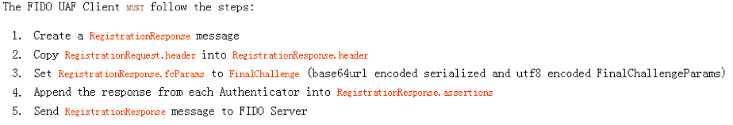  

注意，其中只是将authenticator的返回报文中的ASSERTION部分copy了出来，因此UAF Client的Response报文并没有包含TAG_KEYHANDLE，因此KEYHANDLE也并没有被传递到服务器，而是被保存在了ASM中。

一个例子如下：

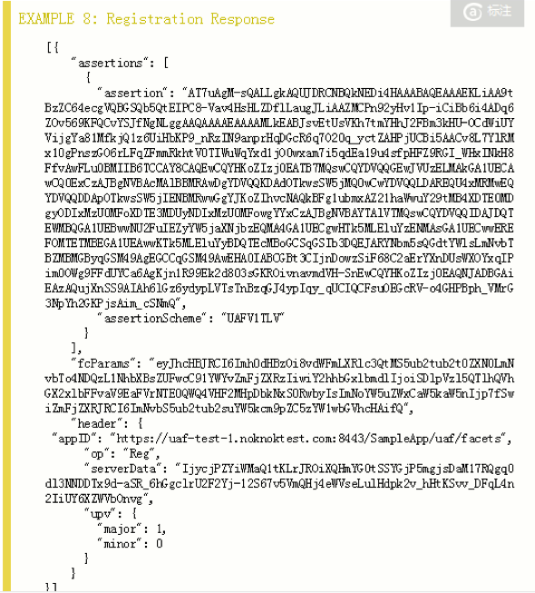  

###六、FIDO Server解析UAF Client发回来的response
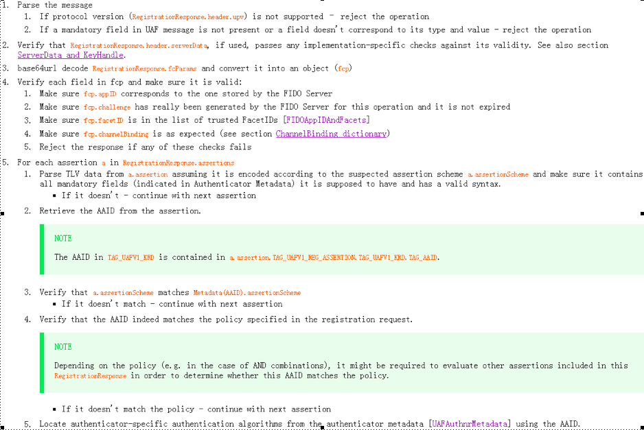  
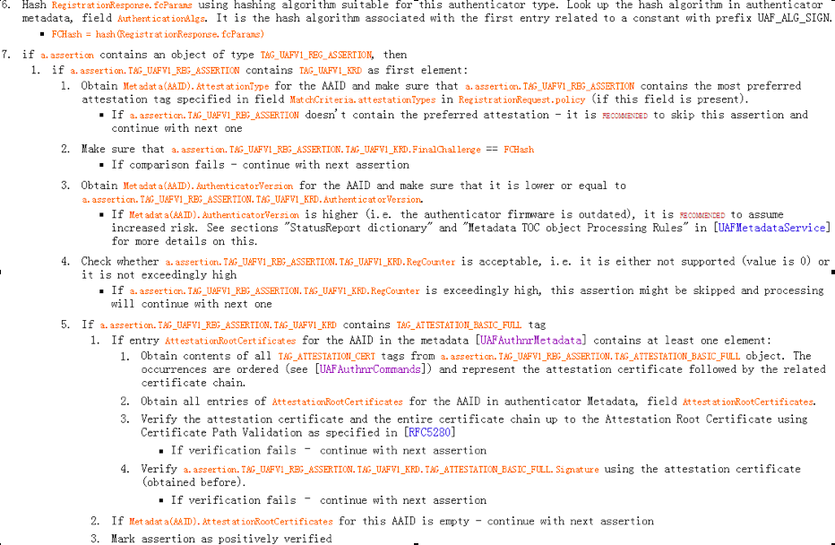  
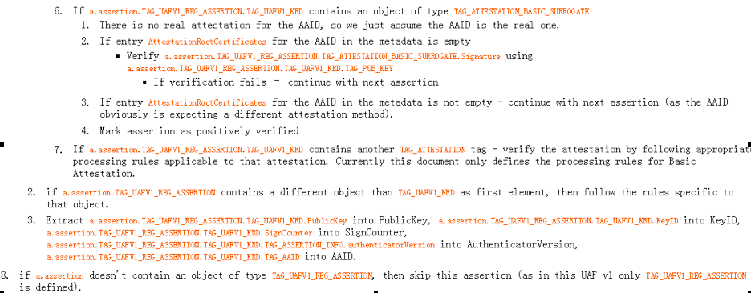  
前面的步骤就是一堆验证，重点在于对attestation certificate的验证。
最后Server存储PublicKey, KeyID, SignCounter, AuthenticatorVersion, AAID和tcDisplayPNGCharacteristic到一个record，这个record用AAID和KeyID标识。（**另一个文档中有说，(AAID, KeyID)标识一个认证器对一个RP的注册**）

#关于FIDO的验证过程总结
###一、 FIDO Server向FIDO Client发送的UAF Authentication Request
除了op变成"Auth"，没有username,其余跟Registration一样.

这里猜测：因为用户需要先登陆网站，所以网站服务器会查找到该用户名所对应的那些注册过的KeyIDs？所以，policy里应该有KeyIDs？反正，FIDO Client会根据policy来筛选认证器给用户选择，因此，policy所筛选出来的认证器应该是用户已经注册过的。之所以会猜测应该有KeyIDs是因为，后面FIDO Client有`AuthenticateIn`中，有appID和keyIDs,否则这个keyIDs从何而来？

	[{
		"header": {
			"upv": {
				"major": 1,
				"minor": 0
			},
			"op": "Auth",
			"appID": "https://uaf-test-1.noknoktest.com:8443/SampleApp/uaf/facets"
			"serverData": "5s7n8-7_LDAtRIKKYqbAtTTOezVKCjl2mPorYzbpxRrZ-_3wWroMXsF_pLYjNVm_l7bplAx4bkEwK6ibil9EHGfdfKOQ1q0tyEkNJFOgqdjVmLioroxgThlj8Istpt7q"
		},
		"challenge": "HQ1VkTUQC1NJDOo6OOWdxewrb9i5WthjfKIehFxpeuU",
		"policy": {
			"accepted": [
				[
					{
						"userVerification": 512,
						"keyProtection": 1,
						"tcDisplay": 1,
						"authenticationAlgorithms": [
							1
						],
						"assertionSchemes": [
							"UAFV1TLV"
						]
					}
				],
				[
					{
						"userVerification": 4,
						"keyProtection": 1,
						"tcDisplay": 1,
						"authenticationAlgorithms": [
							1
						],
						"assertionSchemes": [
							"UAFV1TLV"
						]
					}
				],
				[
					{
						"userVerification": 4,
						"keyProtection": 1,
						"tcDisplay": 1,
						"authenticationAlgorithms": [
							2
						]
					}
				],
				[
					{
						"userVerification": 2,
						"keyProtection": 4,
						"tcDisplay": 1,
						"authenticationAlgorithms": [
							2
						]
					}
				],
				[
					{
						"userVerification": 4,
						"keyProtection": 2,
						"tcDisplay": 1,
						"authenticationAlgorithms": [
							1,
							3
						]
					}
				],
				[
					{
						"userVerification": 2,
						"keyProtection": 2,
						"authenticationAlgorithms": [
							2
						]
					}
				],
				[
					{
						"userVerification": 32,
						"keyProtection": 2,
						"assertionSchemes": [
							"UAFV1TLV"
						]
					},
					{
						"userVerification": 2,
						"authenticationAlgorithms": [
							1,
							3
						],
						"assertionSchemes": [
							"UAFV1TLV"
						]
					},
					{
						"userVerification": 2,
						"authenticationAlgorithms": [
							1,
							3
						],
						"assertionSchemes": [
							"UAFV1TLV"
						]
					},
					{
						"userVerification": 4,
						"keyProtection": 1,
						"authenticationAlgorithms": [
							1,
							3
						],
						"assertionSchemes": [
							"UAFV1TLV"
						]
					}
				]
			],
			"disallowed": [
				{
					"userVerification": 512,
					"keyProtection": 16,
					"assertionSchemes": [
						"UAFV1TLV"
					]
				},
				{
					"userVerification": 256,
					"keyProtection": 16
				}
			]
		}
	 }]


###二、 FIDO Client给ASM生成的ASMRequest
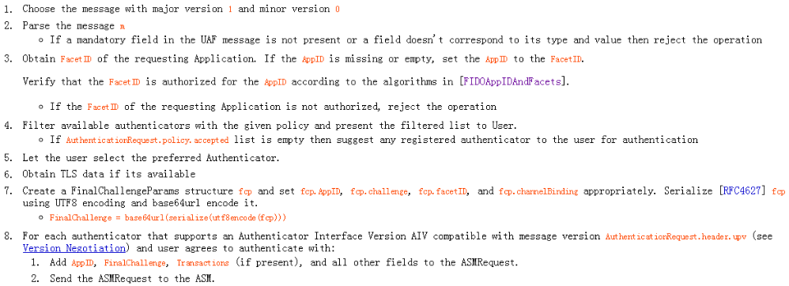

除了第8步，其余跟Registration差不多。关于这个Authenticator Interface Version是什么还没搞清。

###三、 ASM向authenticator发送的Sign Command
在ASM API文档中：
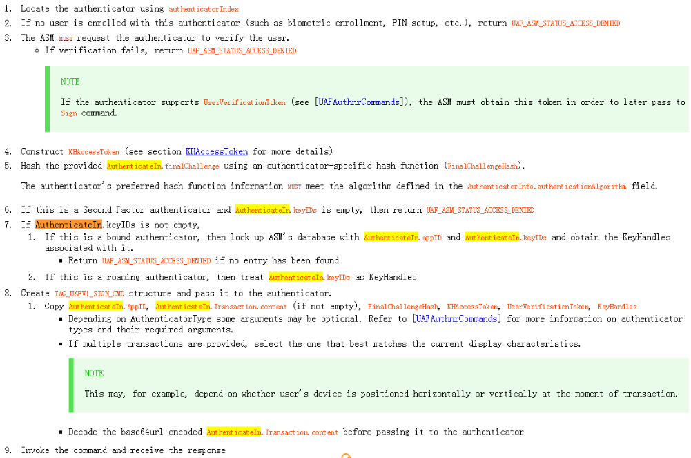
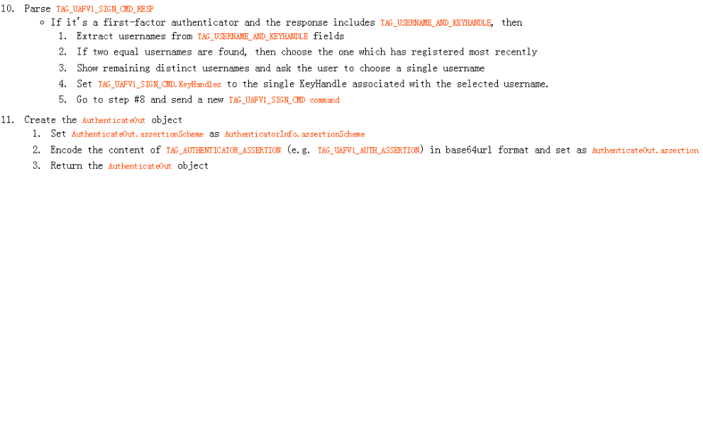  
注意，在第7步中，ASM根据AuthenticateIn.keyID和AuthenticateIn.appID来筛选了KeyHandles，填充到了下面的TAG_UAFV1_SIGN_CMD中。之后，认证器根据AccessToken过滤后如果还是有多个KeyHandle，则会到这里的第10步，让用户去选择一个。
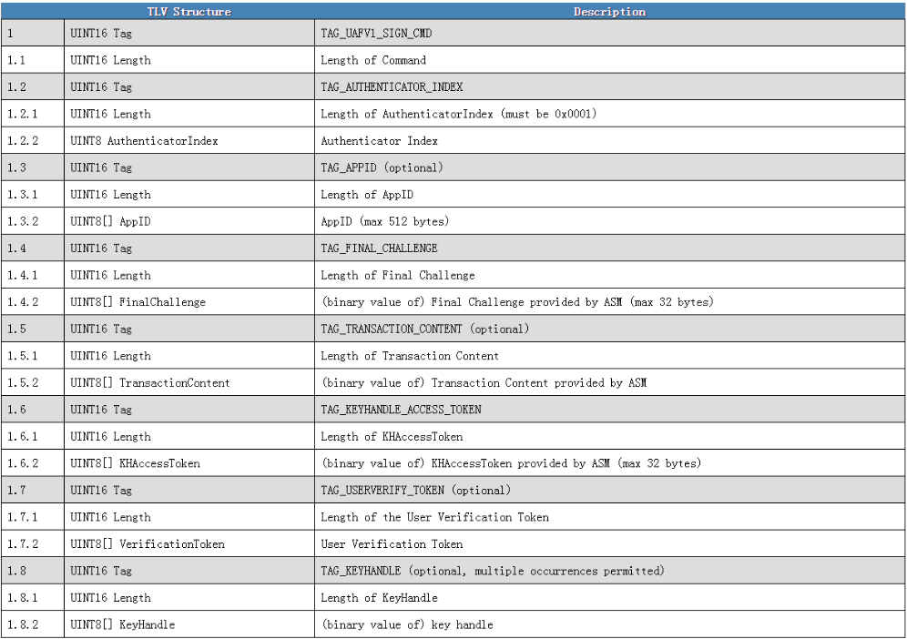  
ASM怎么确定`TAG_AUTHENTICATOR_INDEX`的值？  
其中的`TAG_KEYHANDLE`被允许多次出现，这是为什么？

###四、 authenticator生成TAG_UAFV1_SIGN_CMD_RESPONSE发给ASM
`TAG_UAF_AUTH_ASSERTION`的结构如下：
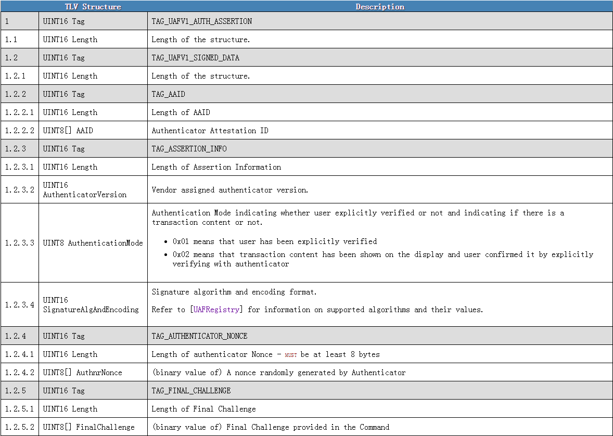  
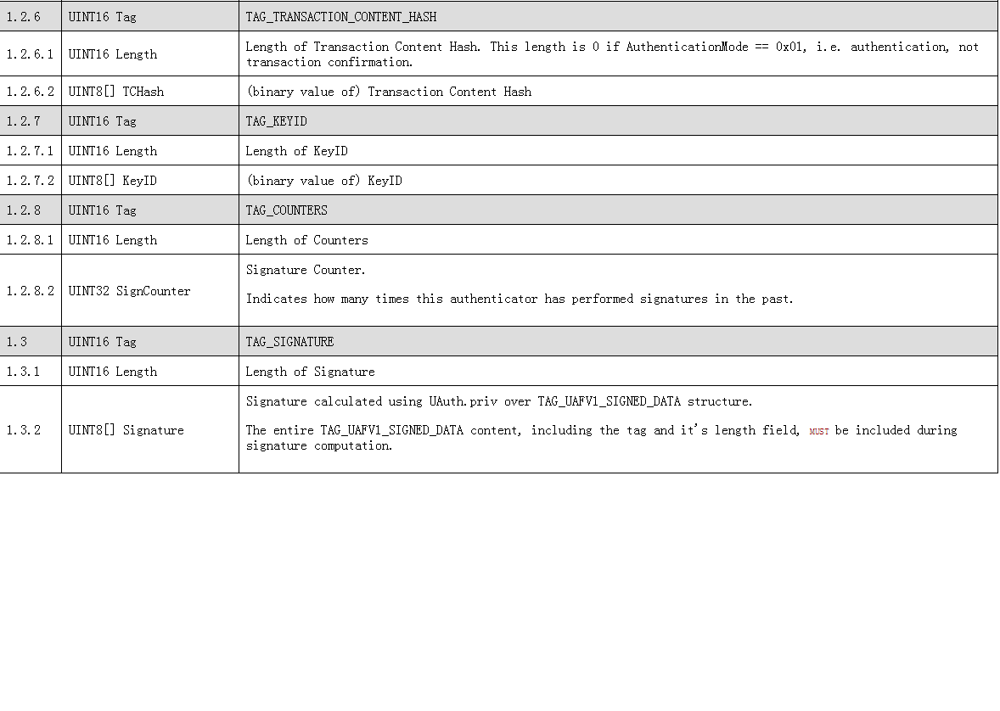  
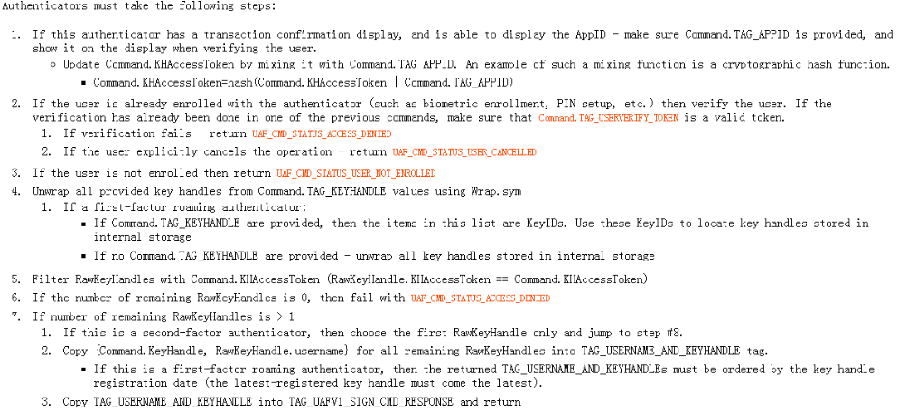  
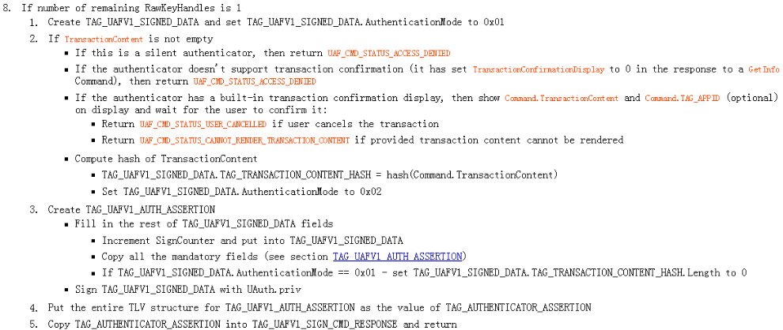  
前面跟registration差不多。  
第7步，如果通过`KHAccessToken`筛选后还有多个`RawKeyHandle`，那么就copy所有剩下的`RawKeyHandle`的`{Command.KeyHandle, RawKeyHandle.username}`到`TAG_USERNAME_AND_KEYHANDLE`中，然后copy这个`TAG_USERNAME_AND_KEYHANDLE`到`TAG_UAFV1_SIGN_CMD_RESPONSE`并返回。  
第8步，如果`RawKeyHandle`只剩1个，创建`TAG_UAFV1_SIGNED_DATA`并且设置`TAG_UAFV1_SIGNED_DATA.AuthenticationMode`为`0x01`
创建`TAG_UAFV1_AUTH_ASSERTION`，
