### 1. 报文中的header
格式如下：

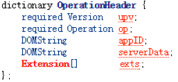

upv：
uaf protocol version，major是主版本号，minor是次版本号。目前必须是1.0

op：
operation, 有 “Reg”, “Auth”(Authentication or Transaction Confirmation), “Dereg”.

appID:
见【名词解释】

serverData：
见【名词解释】

### 2. AppID

The AppID is an identifier for a set of different Facets of a relying party's application. The AppID is a URL pointing to the TrustedApps, i.e. list of FacetIDs related to this AppID.

就是说，AppID是RP应用的不同Facets集合的标识ID。AppID应该是一个指向TrustedApps列表的URL，这个列表就是FacetID列表。【**(a)如果是一个facetID集合，则AppID是一个URL指向的列表；(b)如果就是一个facetID，那么该facetID就是AppID**】

有3种方式去设置AppID：

1. 如果在请求报文里，AppID是空，那么FIDO UAF Client必须将其设置为Caller的FacetID（这里的Caller就是User Agent客户端的facetID）。【**其实这里AppID为空的意义在于表示RP接受任何形式的application的identifier**】
2. 如果报文中的appID同caller的FacetID相同，那么FIDO UAF Client必须接受它。【**情况(b)**】
3. 如果AppID是一个URI，那么FIDO UAF Client必须去加载这个URI所指向的trusted facet identifiers的列表。如果caller的facetID matches 这个trusted facet identifiers列表中的一个，那么FIDO UAF Client就必须接受这个请求。【**情况(b)**】  
>后面新生成的UAuth公私钥对将和appID关联在一起  
FIDO UAF Client 用这个AppID来验证一个application的资格，触发使用特定的UAuth.Key

### 3. serverData(协议并没规定serverData是怎样的)
serverData就是RP创建的一个会话ID，以及其他客户端难懂的数据。服务器使用MAC校验来保证serverData的完整性。
根据ebay的开源项目中的代码：

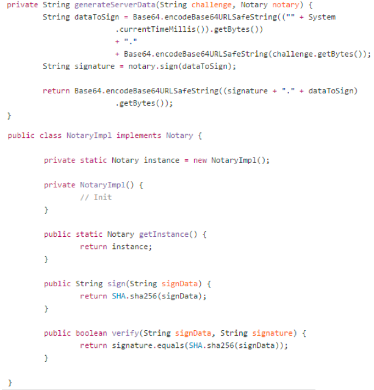

dataToSign = 系统时间 + challenge

Signature = SHA.sha256(dataToSign)

serverData = Base64.encodeBase64URLSafeString((signature + “.” + dataToSign).getBytes());

### 4. Metadata【详细可以参见官方文档authnr-metadata】

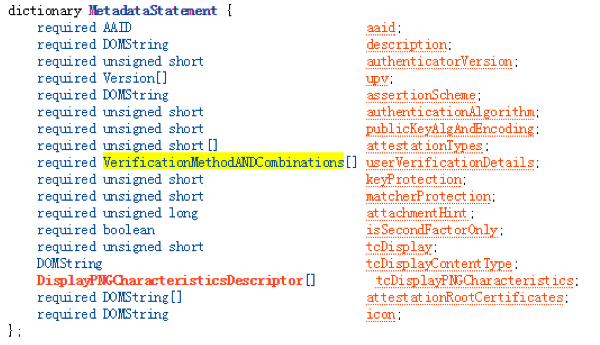

---
__aaid__：见【名词解释】

__description__: 对该authenticator的一些描述信息

__authenticatorVersion__: 认证器版本

__upv__: UAF Protocol Version

__assertionScheme__: 目前只支持UAFV1TVL

__authenticationAlgorithm__: 认证器支持的认证算法（见uaf-reg文档）,都是以`UAF_ALG`作为前缀。这里的签名是指的认证器生成的公私钥对`UAuth.pub/UAuth.priv`的在认证时的签名算法。
*UAF_ALG_SIGN_SECP256R1_ECDSA_SHA256_RAW 0x01
UAF_ALG_SIGN_SECP256R1_ECDSA_SHA256_DER 0x02
UAF_ALG_SIGN_RSASSA_PSS_SHA256_RAW 0x03
UAF_ALG_SIGN_RSASSA_PSS_SHA256_DER 0x04
UAF_ALG_SIGN_SECP256K1_ECDSA_SHA256_RAW 0x05
UAF_ALG_SIGN_SECP256K1_ECDSA_SHA256_DER 0x06*

__publicKeyAlgAndEncoding__: 公钥生成算法及其编码
*UAF_ALG_KEY_ECC_X962_RAW 0x100  
UAF_ALG_KEY_ECC_X962_DER 0x101
UAF_ALG_KEY_RSA_2048_PSS_RAW 0x102
UAF_ALG_KEY_RSA_2048_PSS_DER 0x103*

__attestationTypes__: 协议定义了3种：  
*TAG_ATTESTATION_CERT 0x2E05  
Indicates DER encoded attestation certificate.  
TAG_ATTESTATION_BASIC_FULL 0x3E07  
Indicates full basic attestation as defined in [UAFProtocol].  
TAG_ATTESTATION_BASIC_SURROGATE 0x3E08  
Indicates surrogate basic attestation as defined in [UAFProtocol].*

__userVerificationDetails__:这是一个VerificationMethodANDCombinations的数组。VerificationMethodANDCombinations的结构如下：  


由上可见这又是一个VerificationMethodDescriptor的数组。这个”ANDCombination”就已经表明userVerification（一次用户认证）必须是这些VerificationMethodDescriptor数组所指方法同时通过才能完成用户认证。VerificationMethodDescriptor的结构定义如下：  
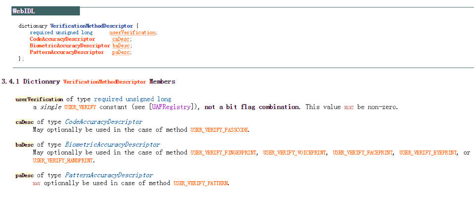   
第一个元素：userVerificationo是一个USER_VERIFY前缀的预定义常量（见文档uaf-reg）：
*USER_VERIFY_PRESENCE 0x01  
USER_VERIFY_FINGERPRINT 0x02  
USER_VERIFY_PASSCODE 0x04  
USER_VERIFY_VOICEPRINT 0x08  
USER_VERIFY_FACEPRINT 0x10  
USER_VERIFY_LOCATION 0x20  
USER_VERIFY_EYEPRINT 0x40  
USER_VERIFY_PATTERN 0x80  
USER_VERIFY_HANDPRINT 0x100  
USER_VERIFY_NONE 0x200  
USER_VERIFY_ALL 0x400*  
下面三个元素是上面这些认证方法的描述子。例如：  

base：进制；minLenght：最小长度；maxRetries：最多可试次数；blockSlowdown：多少秒之后可重试

__keyProtection__: 见本文档的MatchCriteria

__matcherProtection__: 见本文档的MatchCriteria

__attachmentHint__: 见本文档的MatchCriteria

__isSecondFactorOnly__: 该验证器是否只被用作second factor（如果是，则还需要first factor，如username + password）

__tcDisplay__: 如果是0，则不支持
__tcDisplayContentType__:
__tcDisplayPNGCharacteristics__: 以上3个都是transaction confirm相关

__attestationRootCertificates__: 有点复杂，直接上截图：  
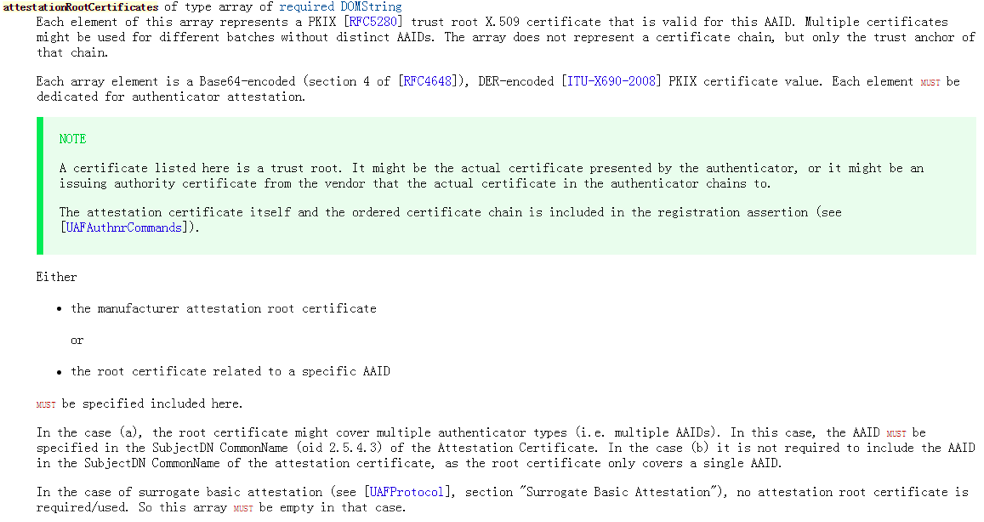  
大概意思就是，这个证书数组不是一个证书链，而是一个trust root X.509 certificate数组（信任锚的数组）。**而真正的attestation certificate 和 the ordered certificate chain是包含在registration assertion中的**

__Icon__: 一个URL编码的认证器的PNG图片。

---

###5. Policy
  
由accepted和desallowed两部分组成，accepted是一个MatchCriteria的二维数组。MatchCriterial描述了一种Ahtenticator的特征(characteristic)。其第一维度上的MatchCriteria[]之间是或(OR)关系，其第二维度上的MatchCriterial之间是与(AND)关系。  
下面举个例子：  
	// 这里是一个MatchCriterial[1]，只不过只有1个元素
	[
		{
			"userVerification": 2,
			"keyProtection": 2,
			"authenticationAlgorithms":[
				2
			]
		}
	],
	//下面是一个MatchCriterial[4]，有4个元素
	[
		{
			"userVerification": 32,
			"keyProtection": 2,
			"assertionSchemes": [
				"UAFV1TLV"
			]
		},
		{
			"userVerification": 2,
			"authenticationAlgorithms": [
				1,
				3
			],
			"assertionSchemes": [
				"UAFV1TLV"
			]
		},
		{
			"userVerification": 2,
			"authenticationAlgorithms": [
				3
			],
			"assertionSchemes": [
				"UAFV1TLV"
			]
		},
		{
			"userVerification": 4,
			"keyProtection": 1,
			"authenticationAlgorithms": [
				1,
				3
			],
			"assertionSchemes": [
				"UAFV1TLV"
			]
		}
	]
	
上面例子中的Policy表示，接受满足MatchCriterial[1]或(OR)MatchCriterial[4]的authenticators。其中，MatchCriterial[4]表示FIDO Server端只接受同时（与AND关系）满足这4种MatchCriterial的authenticators（即，可能多个authenticator需要同时被注册）。

###6. MatchCriteria
MatchCriterial和Metadata的数据有一些重合，但不是一样的。  
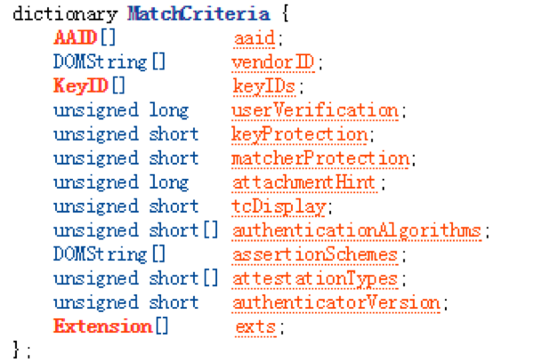  
下面只说明一些元素：  
__KeyIDs__：见【名词解释】

__userVerification__: 这是authenticator characteristics（见fido-uaf-reg文档）中的一种。指出用户本地认证的方法：人脸，指纹等等。以USER_VERIFY做前缀。文档中这样描述：They describe the methods and capabilities of an UAF authenticator for locally verifying a user.



*USER_VERIFY_PRESENCE 0x01*  
This flag must be set if the authenticator is able to confirm user presence in any fashion. If this flag and no other is set for user verification, the guarantee is only that the authenticator cannot be operated without some human intervention, not necessarily that the presence verification provides any level of authentication of the human's identity. (e.g. a device that requires a touch to activate)  
*USER_VERIFY_FINGERPRINT 0x02*  
This flag must be set if the authenticator uses any type of measurement of a fingerprint for user verification.  
*USER_VERIFY_PASSCODE 0x04*  
This flag must be set if the authenticator uses a local-only passcode (i.e. a passcode not known by the server) for user verification.  
*USER_VERIFY_VOICEPRINT 0x08*  
This flag must be set if the authenticator uses a voiceprint (also known as speaker recognition) for user verification.  
*USER_VERIFY_FACEPRINT 0x10*  
This flag must be set if the authenticator uses any manner of face recognition to verify the user.  
*USER_VERIFY_LOCATION 0x20*  
This flag must be set if the authenticator uses any form of location sensor or measurement for user verification.  
*USER_VERIFY_EYEPRINT 0x40*  
This flag must be set if the authenticator uses any form of eye biometrics for user verification.  
*USER_VERIFY_PATTERN 0x80*  
This flag must be set if the authenticator uses a drawn pattern for user verification.  
*USER_VERIFY_HANDPRINT 0x100*  
This flag must be set if the authenticator uses any measurement of a full hand (including palm-print, hand geometry or vein geometry) for user verification.  
*USER_VERIFY_NONE 0x200*  
This flag must be set if the authenticator will respond without any user interaction (e.g. Silent Authenticator).  
*USER_VERIFY_ALL 0x400*  
If an authenticator sets multiple flags for user verification types, it may also set this flag to indicate that all verification methods will be enforced (e.g. faceprint AND voiceprint). If flags for multiple user verification methods are set and this flag is not set, verification with only one is necessary (e.g. fingerprint OR passcode).  

__keyProtection__: 这是authenticator characteristics（见fido-uaf-reg文档）中的一种。指出了认证器在注册过程中保护私钥的方法。  
*KEY_PROTECTION_SOFTWARE 0x01  
KEY_PROTECTION_HARDWARE 0x02  
KEY_PROTECTION_TEE 0x04  
KEY_PROTECTION_SECURE_ELEMENT 0x08  
KEY_PROTECTION_REMOTE_HANDLE 0x10*  

__matcherProtection__: 这是authenticator characteristics（见fido-uaf-reg文档）中的一种。指出了认证器的matcher的保护方法。关于matcher可以看下面的文档描述：  
  

所以，matcher是去本地(locally)认证一个用户的。  
*MATCHER_PROTECTION_SOFTWARE 0x01  
MATCHER_PROTECTION_TEE 0x02  
MATCHER_PROTECTION_ON_CHIP 0x04*  
关于matcher，见【名词解释】

__attatchmentHint__: 这是authenticator characteristics（见fido-uaf-reg文档）中的一种。指出了认证器是怎样连接上设备的。
*ATTACHMENT_HINT_INTERNAL 0x01  
ATTACHMENT_HINT_EXTERNAL 0x02  
ATTACHMENT_HINT_WIRED 0x04  
ATTACHMENT_HINT_WIRELESS 0x08  
ATTACHMENT_HINT_NFC 0x10  
ATTACHMENT_HINT_BLUETOOTH 0x20  
ATTACHMENT_HINT_NETWORK 0x40  
ATTACHMENT_HINT_READY 0x80  
ATTACHMENT_HINT_WIFI_DIRECT 0x100*  

__tcDisplay__: transaction comfirmation的内容

__authenticationAlgorithm__: 这是authenticator characteristics（见fido-uaf-reg文档）中的一种。指明了签名算法及其编码。这里的签名是指的认证器生成的公私钥对UAuth.pub/UAuth.priv的在认证时的签名算法。
*UAF_ALG_SIGN_SECP256R1_ECDSA_SHA256_RAW 0x01
UAF_ALG_SIGN_SECP256R1_ECDSA_SHA256_DER 0x02
UAF_ALG_SIGN_RSASSA_PSS_SHA256_RAW 0x03
UAF_ALG_SIGN_RSASSA_PSS_SHA256_DER 0x04
UAF_ALG_SIGN_SECP256K1_ECDSA_SHA256_RAW 0x05
UAF_ALG_SIGN_SECP256K1_ECDSA_SHA256_DER 0x06*

__assertionSchemes__: 目前只支持UAFV1TLV

__attestationTypes__: 2种attestation方法：  
*TAG_ATTESTATION_BASIC_FULL 0x3E07  
TAG_ATTESTATION_BASIC_SURROGATE 0x3E08*  
Basic Full是基于Attestation Key的，而Basic Sorrogate是没有Attestation的认证器，用UAuth.pub/UAuth.priv来自签名的。

__authenticatorVersion__: 认证器版本

###7. ChannelBinding
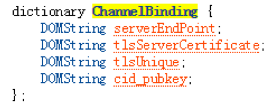  
__serverEndPoint__: 基本上就是TLS server证书的hash值（base64url-encoded）
__tlsServerCertificate__: base64url-encoded, DER-encoded TLS server证书（如果有的话）
__tlsUnique__: base64url-encoded TLS channel Finished structure.
__cid_pubkey__: 有几种可能值，具体查看协议(uaf-protocol)

###8. KHAccessToken
这个东西主要是一种访问控制机制，确保只有最初请求authenticator生成keys(UAuth.pub/priv)的ASM能够去访问这个keys。  
一般来说由4部分组成：AppID, PersonaID, ASMToken, CallerID。  
AppID可见【名词解释】  
PersonaID：一般是操作系统用户ID  
ASMToken：由该ASM生成的随机值。在ASM第一次运行时生成，并由ASM一直持有。  
CallerID：FIDO UAF Client的ID。Android平台就是apk-signing-cert。  
ASM每次同authenticator交互的命令时，ASM都需要提供KHAccessToken。  

在Register Request时，ASM生成KHAccessToken:  

* Append AppID: KHAccessToken = AppID  
* 如果是一个bound authenticator，则还要append ASMToken, PersonaID, CallerID: KHAccessToken |= ASMToken | PersonaID | CallerID
* 用authenticator的hash算法对KHAccessToken做hash：
KHAccessToken = hash(KHAccessToken)
* authenticator将KHAccessToken放入到RawKeyHandle中

之后ASM发送的每一条需要KHAccessToken作为输入的命令，ASM都需要重新计算KHAccessToken发给authenticator，然后authenticator unwraps the provided key handle(s)，对比RawKeyHandle.KHAccessToken和ASM重新计算后所提供的KHAccessToken是否一样。

###9. RawKeyHandle
一般对于first-factor bound authenticator，其RawKeyHandle结构一般如下：

First Factor authenticator 必须存储Username, 而Second Factor authenticator则不能存储Username。  
RawKeyHandle只要离开authenticator boundary就需要被wrapped。  
这个Key Wrap算法如下：  
<http://csrc.nist.gov/groups/ST/toolkit/documents/kms/key-wrap.pdf>  
<https://en.wikipedia.org/wiki/Key_Wrap>  
<https://tools.ietf.org/html/rfc5297>  
<http://nvlpubs.nist.gov/nistpubs/SpecialPublications/NIST.SP.800-38F.pdf>    
在文档fido-uaf-authnr-cmds-v1.0中：    
  

Wrap后叫做`KeyHandle`。在认证过程中，在`AuthenticateIn.KeyIDs`不为空的情况下：
1. 如果是一个bound认证器(KeyID是随机数)，那就查找ASM的数据库，用`AuthenticateIn.appID`和`AuthenticateIn.keyIDs`找到关联的`KeyHandles`(**KeyIDs为复数是因为，一个用户可能注册了多个认证器，一个认证器在一个RP上注册一次会对应一个KeyID。见【名词解释】**)  
2. 如果是一个roaming认证器，那就将`AuthenticateIn.keyIDs`作为`KeyHandles`

###10. Matcher
在文档：<https://fidoalliance.org/specs/fido-uaf-v1.0-ps-20141208/fido-uaf-authnr-cmds-v1.0-ps-20141208.html#command-description-2>   

###11. UserVerificationToken
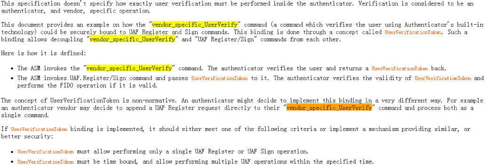  
然而我并没有找到vendor_specific_UserVerify这个命令。
在glossary中:  

所以，这个user verification应该在Rgister之前就要做？Verify成功后，由authenticator生成User Verification Token并交给ASM，之后ASM在Register Command中带上这个token，这样在注册时就不用再要用户进行指纹认证了。Token的生成原理，由认证器自己实现。

所以，这个应用场景应该是这样的：首先手机总有个第一次需要用户录入指纹的场景，这个第一次录入叫做enroll。然后，在打开FIDO APP后，该APP需要verify这个user是不是录入指纹的user（用命令verdor_specific_UserVerify），verify成功的话，认证器则生成User Verification Token并交给ASM。之后ASM在做Register和sign命令时，只要带上这个token就行了，这样就不需要再让用户verify指纹了。当然也可以在register时去同时verify这个user。

###12. KeyID
一个AAID可以对应多个KeyID，但在一个AAID范围内KeyID必须是唯一的。它用于引用一个特定的UAuth.Key。由认证器生成，FIDO Server注册。
(AAID, KeyID)唯一标识一个认证器对一个RP的注册。  
没有内部存储的Roaming authenticctors，而且不依赖任何ASM的存储的认证器，应该将其生成的key handles放入`AuthenticatorRegistrationAssertion.assertion.KeyID`中，并且在之后的step-up认证和注销过程中从FIDO Server取回key handle。
>KeyID的具体结构依赖于认证器的具体实现。
KeyID是在认证器生成`TAG_UAFV1_KRD`时所构造的：  
1. 如果是2因子roaming认证器，将key handle放入`TAG_KEYID`
2. 否则，随机生成KeyID放入`TAG_KEYID`

如果KeyID是随机值，那么它应该存放在认证器内部RawKeyHandle中，在后面SignCommand中会用到
###13. KeyIDs and key handles
一共有4种不同类型的认证器，如下所示：  
总体上来说，bound认证器将keyhandle存储在ASM中，

1. 注册时，将KeyHandle存储在ASM，生成的KeyID是一个随机值。认证时，如果服务器没有user session，那么服务器不会提供任何KeyIDs（因为根本不知道需要提供哪个KeyID）。这种情况下，ASM将其持有的所有KeyHandle传给认证器。但在step-up认证过程中（有user session），服务器需要提供相关的KeyIDs，ASM根据服务器提供的KeyIDs选择相应的KeyHandles给认证器。  
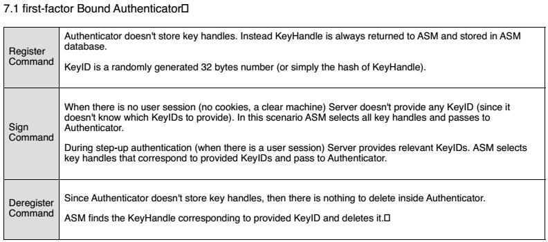
2. 注册时，将KeyHandle存储在ASM，生成的KeyID是一个随机值。认证时，由于是2ndF Bound Authenticator的缘故，所以用户首先要用自己的1stF来登录，因此服务器那边一定要有user session。服务器根据user session来提供相应的KeyIDs。
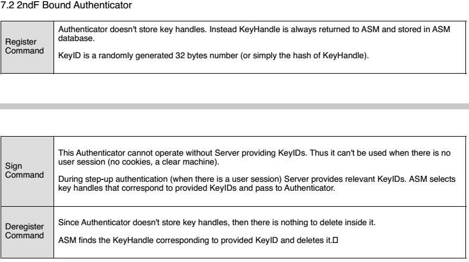
3. 注册时，将KeyHandle存储在认证器内部，生成的KeyID是一个随机值。认证时，如果服务器没有user session，那么服务器不会提供任何KeyIDs（因为根本不知道需要提供哪个KeyID）。这种情况下，认证器使用AppID所关联的所有KeyHandles。但在step-up认证过程中（有user session），服务器需要提供相关的KeyIDs，认证器根据服务器提供的KeyIDs选择相应的KeyHandles给认证器。  
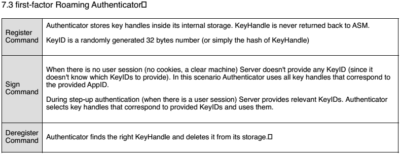
4. 不论是ASM还是认证器都不会存储KeyHandle，而是将KeyHandle传给Server（用KeyHandle来代替KeyID），在服务器看来这个KeyID，但实际上KeyID是KeyHandle。认证时，服务器必须提供KeyIDs。


###14. AAID
在服务器的authenticator metadata repository中的每一个条目都必须identified with一个AAID