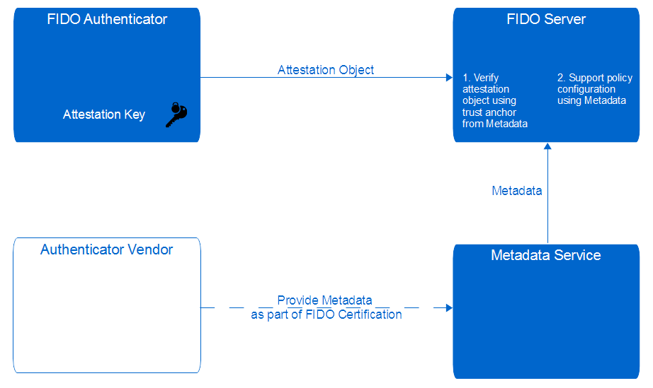
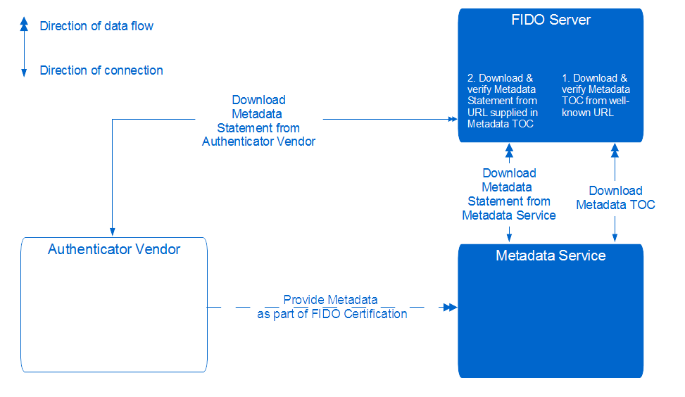

###1. Metadata的工作流
一个authenticator metadata statement的工作流如下所示：  
1. The authenticator vendor produces a metadata statement describing the characteristics of an authenticator.  
2. The metadata statement is submitted to the FIDO Aliance **as part of the FIDO certification process**. The FIDO Alliance distributes the metadata as described in [UAFMetadataService].  
3. A FIDO relying party configures its registration policy to allow authenticators matching certain characteristics to be registered.  
4. The FIDO server sends a registration challenge message containing this policy statement.  
5. The FIDO UAF Client receives the policy statement as part of the challenge message. It queries available authenticators for their self-reported characteristics and (with the user's input) selects an authenticator that matches the policy, to be registered.  
6. The client processes and sends a registration response message to the server. This message contains the AAID for the authenticator and, optionally, a signature made with the private key corresponding to the public key in the authenticator's attestation certificate.  
7. The FIDO Server looks up the metadata statement for the authenticator **using the authenticator's AAID**. If the metadata statement lists an attestation certificate(s), it verifies that an attestation signature is present, and made with the private key corresponding to either (a) one of the certificates listed in this metadata statement or (b) corrsponding to the public key in a certificate that chains to one of the issuer certificates listed in the authenticator's metadata statement.  
8. The FIDO Server next verifies that the authenticator meets the originally supplied registration policy based on its authoritative metadata statement. This prevents a faulty, modified, or compromised FIDO UAF Client from registering authenticators that are out of policy.  
9. Optionally, a FIDO Server may, with input from the Relying Party, assign a risk or trust score to the authenticator, based on its metadata, including elements not selected for by the stated policy.  
10. Optionally, a FIDO Server may cross-reference the attested AAID of the authenticator with other metadata databases published by third parties. Such third-party metadata might, for example, inform the FIDO Server if an authenticator has achieved certifications relevant to certain markets or industry verticals, or whether it meets application-specific regulatory requirements.

###2.Metadata Keys
Metadata的元素可以见【名词解释】

#####Metadata Service Overview

其中，Attestation Object其实主要就是KRD。KRD中包含了attestation证书和证书链，而FIDO SERVER则有trust anchor，因此就可以检验认证器的合法性了。

#####Detailed Architecture

FIDO SERVER选择TOC文件中一个条目（使用AAID进行定位，一个条目对应一个认证器），根据该record中的URL去下载Metadata Statement。注意到，**图中FIDO SERVER可能从两个来源下载Metadata Statement，一个是Vendor，一个是Metadata Service（FIDO官方的）**

TOC的一个条目如下：  
dictionary MetadataTOCPayloadEntry {  
    required AAID           **aaid**;  
    required DOMString      **hash**;  
    required DOMString      **url**;  
    required StatusReport[] **statusReports**;  
    required DOMString      **timeOfLastStatusChange**;  
};

FIDO SERVER根据hash值来判断其下载的Metadata的正确性。

